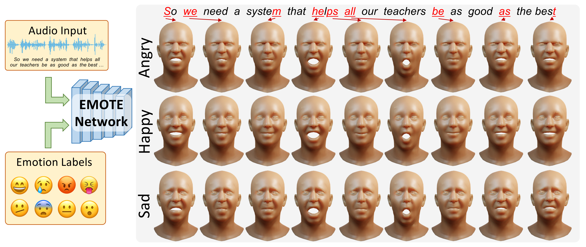

# EMOTE : Emotional Speech-Driven Animation with Content-Emotion Disentanglement

  <p align="center">
    <a href="https://ps.is.tuebingen.mpg.de/person/rdanecek"><strong>Radek Daněček</strong></a>    
    ·
    <a href="https://www.kth.se/profile/chhatre"><strong>Kiran Chhatre</strong></a>
    .
    <a href="https://ps.is.tuebingen.mpg.de/person/stripathi"><strong>Shashank Tripathi</strong></a>
    .
    <a href="https://ps.is.tuebingen.mpg.de/person/ywen"><strong>Yandong Wen</strong></a>
    .
    <a href="https://ps.is.tuebingen.mpg.de/person/black"><strong>Michael J. Black</strong></a>
    ·
    <a href="https://sites.google.com/site/bolkartt"><strong>Timo Bolkart</strong></a>
  </p>
  
  <h2 align="center">Siggraph Asia 2023, Sydney, Australia</h2>
  
  <div align="center">
  </div> 

 


<p align="center">
  <br>
    <a href="https://pytorch.org/get-started/locally/"></a>
    <a href="https://pytorchlightning.ai/"></a>
    <a href='https://arxiv.org/abs/2306.08990'>
      
    </a>
    <a href='https://emote.is.tue.mpg.de/' style='padding-left: 0.5rem;'>
      
    </a>
</p>


This is the official implementation of [EMOTE : Emotional Speech-Driven Animation with Copntent-Emotion Disentanglement](https://emote.is.tue.mpg.de/). 
EMOTE takes speech audio and an emotion and intensity labels on the input and produces a talking head avatar that correctly articulates the words spoken in the audio while expressing the specified emotion.

## News 
- (13th Dec. 2023) EMOTE v2 is now out! It is trained on a newer iteration of the data and should give better results overall. EMOTE v1 is still available. Please see the demo script for details.


## Installation 

1) Follow the steps at the [root of this repo](../..). If for some reason the environment from there is not valid, create one using a `.yml` file from `envs`.

2) In order to run the demos you will need to download and unzip a few assets. Run `download_assets.sh` to do that: 
```bash 
bash download_assets.sh
```
3) (Optional for inference, required for training) [Basel Face Model](https://faces.dmi.unibas.ch/bfm/bfm2019.html) texture space adapted to FLAME. Unfortunately, we are not allowed to distribute the texture space, since the license does not permit it. Therefore, please go to the [BFM page](https://faces.dmi.unibas.ch/bfm/bfm2019.html) sign up and dowload BFM. Then use the tool from this [repo](https://github.com/TimoBolkart/BFM_to_FLAME) to convert the texture space to FLAME. Put the resulting texture model file file into [`../../assets/FLAME/texture`](../../assets/FLAME/texture) as `FLAME_albedo_from_BFM.npz`


## Demos 

Then activate your environment: 
```bash
conda activate work38
```

### Create a speech-driven animation for all of 8 basic emotions
If you want to run EMOTE on the demo audio file, run the following:

```bash 
python demo/demo_eval_talking_head_on_audio.py 
```

The script will save the output meshes and videos into `.results/` for each of the 9 basic emotions.

To run the demo on any audio, run:
```bash 
python demo/demo_eval_talking_head_on_audio.py --path_to_audio <your_wav_file> --output_folder <your_output_folder>
```
If you only want results for a particular emotion, specify `--emotion` followed by one of: `Neutral`, `Happy`, `Sad`, `Surprise`, `Fear`, `Disgust`,`Anger`, `Contempt`. 
You may also specify more of them and seperate them with `,`.


## Training 

Training EMOTE is a multi-step process which consists of: 

1) MEAD data processing 
    - including pseudo-GT extraction
    - for more information about this step go to [data processing](./data_processing/)

2) Training video emotion classifier on MEAD 
    - this classifier predicts the emotion and intensity label on MEAD videos 
    - an sequence-aggregated emotion feature is a byproduct of the classifier and it will be used for the emotion loss in training EMOTE 
    - for more information about this step go to the [Video Emotion Recognition project](../VideoEmotionRecognition/)

3) Training the FLINT Motion Prior 
    - the motion prior is a critical component of EMOTE. It is impossible to apply perceptual losses and not get uncanny artifacts without it
    - for more information, go to the [Motion Prior project](../MotionPrior/)

4) Training the first stage of EMOTE 
    - training only with vertex error loss
    - refer to [`training/train_emote_stage_1.py`](./training/train_emote_stage_1.py). Please read the instruction in the comments and then run the script.

5) Training the second stage of EMOTE 
    - finetuning the previous stage with neural renderering, with perceptual losses, with content-emotion disentanglement mechanism
    - refer to [`training/train_emote_stage_1.py`](./training/train_emote_stage_1.py). Please read the instruction in the comments, replace the paths to the models you want to be finetuning with, and then run the script.


## Citation 

If you use this work in your publication, please cite the following:
```
@inproceedings{EMOTE,
  title = {Emotional Speech-Driven Animation with Content-Emotion Disentanglement},
  author = {Daněček, Radek and Chhatre, Kiran and Tripathi, Shashank and Wen, Yandong and Black, Michael and Bolkart, Timo},
  publisher = {ACM},
  month = dec,
  year = {2023},
  doi = {10.1145/3610548.3618183},
  url = {https://emote.is.tue.mpg.de/index.html},
  month_numeric = {12}
}
```
